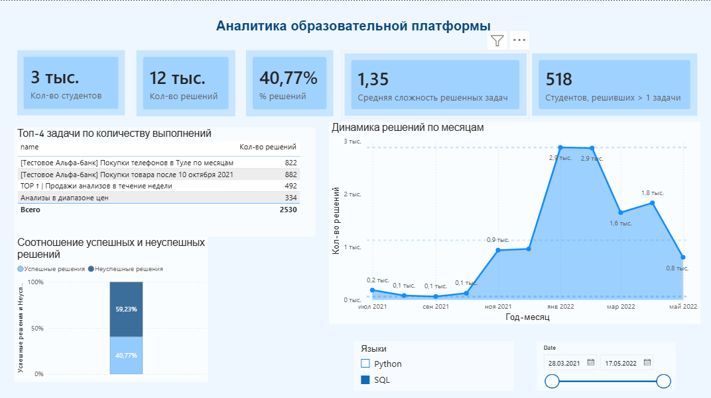
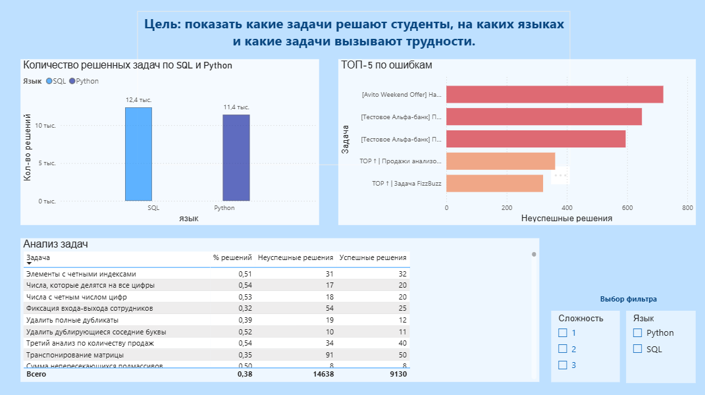
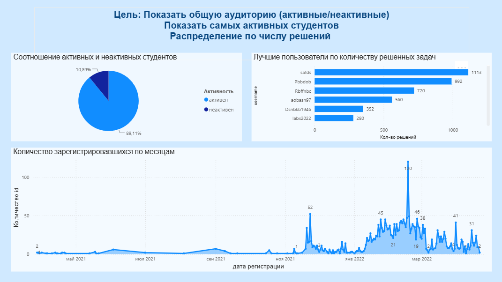

# Анализ образовательной платформы Simulative

> Исследование факторов активности, успешности и удержания пользователей + дашборд в Power BI.

---

## О проекте

Образовательная платформа для аналитиков данных.  
Пользователи решают задачи, проходят тесты, получают очки опыта (score) и взаимодействуют с системой.

**Цель анализа:**  
Определить ключевые факторы, влияющие на:
- Активность пользователей
- Успешность решения задач
- Удержание пользователей

---

## Технологии

`Python` · `Pandas` · `NumPy` · `SciPy` · `Matplotlib` · `Seaborn`  
`Power BI` · `DAX` · `Power Query`

---

## Результаты статистического анализа

| Гипотеза | Результат | Вывод |
|----------|-----------|-------|
| Компании отличаются по среднему score | Подтверждена | Есть компании-лидеры и аутсайдеры |
| Успешность зависит от языка программирования | Подтверждена | Python сложнее SQL |
| Компании различаются по активности | Подтверждена | Активность зависит от корпоративной культуры |
| Активных пользователей > 50% | Подтверждена | 89.11% активных пользователей |
| Доля успешных решений > 50% | Не подтверждена | 38.41% — зона роста |

**Ключевые выводы:**
- 89.11% пользователей активны — высокий показатель удержания
- Доля успешных решений всего 38.41% — задачи слишком сложные
- Python вызывает больше ошибок, чем SQL
- Компании сильно различаются по вовлечённости сотрудников

---

## Дашборд в Power BI

### Страница 1: Общая картина

### Страница 2: Анализ задач

### Страница 3: Пользователи

---

## Ссылки

- [Jupyter Notebook с анализом](Статистика.ipynb)
- [PDF-версия ноутбука](Статистика.pdf)
- [Дашборд Power BI (.pbix)](https://disk.yandex.ru/d/T4fBa_t0xnfnSw)

---

## Контакты

- Email: kstimonova@mail.ru
- GitHub: [kozyaa](https://github.com/kozyaa)